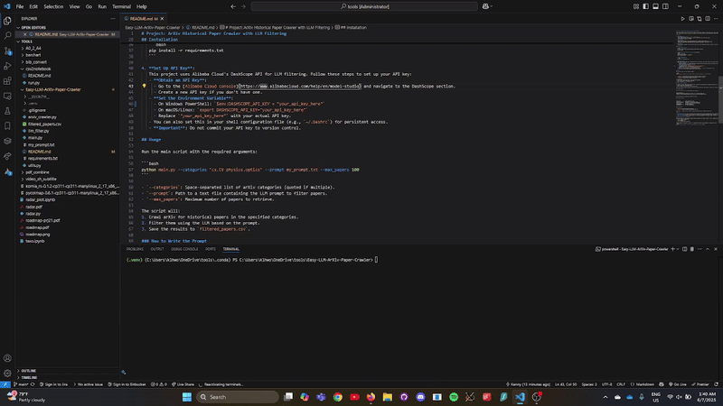

Below is an enhanced version of the README file with added emojis for visual appeal and a section for tracking repository views (today/total). Since there's no prior artifact to update, a new UUID is used for the artifact.


# 🌟 ArXiv Historical Paper Crawler with LLM Filtering 📚

Welcome to the **ArXiv Historical Paper Crawler**! 🚀 This project lets you crawl [arXiv](https://arxiv.org/) for papers from your favorite categories, filter them using a Large Language Model (LLM) with a custom prompt, and save the results to a tidy CSV file. Unlike daily crawlers, this tool dives into *historical papers* up to a user-defined limit, perfect for building a comprehensive research collection. 📖



## ✨ Features

- **User Inputs**:
  - 📋 List of arXiv categories (e.g., `cs.CV`, `physics.optics`).
  - ✍️ Custom LLM prompt for filtering papers (e.g., "Is this paper about image generation?").
  - 🔢 Maximum number of papers to retrieve.

- **Functionality**:
  - 🕸️ Crawls arXiv for papers in specified categories, including historical archives.
  - 🧠 Uses an LLM (via Alibaba Cloud DashScope API) to filter papers based on your prompt.
  - 📄 Outputs a CSV file (`filtered_papers.csv`) with `Paper Name` and `PDF Link`.

- **Automation**:
  - ⚙️ Fetches papers in batches, starting from the most recent, until the max limit is reached or no more papers are available.

## 🛠️ Installation

1. **Clone the Repository**:
   ```bash
   git clone https://github.com/Kenn3o3/Easy-LLM-ArXiv-Paper-Crawler.git
   cd arxiv_crawler
   ```

2. **Create and Activate a Virtual Environment** (Recommended):
   ```bash
   python3 -m venv .venv
   source .venv/bin/activate  # macOS/Linux
   .venv\Scripts\activate     # Windows
   ```

3. **Install Dependencies**:
   ```bash
   pip install -r requirements.txt
   ```

4. **Set Up API Key** 🔑:
   This project uses Alibaba Cloud's DashScope API for LLM filtering. Here's how to set it up:
   - **Obtain an API Key**:
     - Visit the [Alibaba Cloud console](https://www.alibabacloud.com/help/en/model-studio) > Model Studio > Activate Now.
     - Generate a new API key if you don't have one.
   - **Set the Environment Variable**:
     - Windows PowerShell: `$env:DASHSCOPE_API_KEY = "your_api_key_here"`
     - macOS/Linux: `export DASHSCOPE_API_KEY="your_api_key_here"`
     - Replace `"your_api_key_here"` with your actual API key.
   - **Pro Tip**: Add the export command to your shell configuration file (e.g., `~/.bashrc`) for persistent access.
   - **⚠️ Important**: Never commit your API key to version control!

## 🚀 Usage

Run the main script with your desired arguments:

```bash
python main.py --categories "cs.CV physics.optics" --prompt my_prompt.txt --max_papers 100
```

- `--categories`: Space-separated list of arXiv categories (quote if multiple).
- `--prompt`: Path to a text file with the LLM prompt for filtering.
- `--max_papers`: Maximum number of papers to retrieve.

**What happens?**
1. The script crawls arXiv for historical papers in your categories. 🕸️
2. Filters them using the LLM based on your prompt. 🧠
3. Saves the results to `filtered_papers.csv`. 📄

### ✍️ How to Write the Prompt

The prompt tells the LLM how to filter papers. It should be a clear question or statement based on the paper's abstract or title. Examples:
- "Is this paper about image generation?"
- "Does this paper discuss quantum computing algorithms?"

**Tips**:
- Be specific to exclude irrelevant papers.
- Keep it broad enough to capture all relevant ones.
- Save the prompt in a text file (e.g., `my_prompt.txt`).

### 📄 Example Output

The `filtered_papers.csv` file will look like:

```
Paper Name,PDF Link
"Deep Learning for Image Recognition","https://arxiv.org/pdf/1234.5678.pdf"
"Advances in Quantum Computing Algorithms","https://arxiv.org/pdf/9012.3456.pdf"
```

This clean format makes it easy to review and use the results. ✅

## 📂 Project Structure

```
.
├── main.py             # 🚀 Main execution script
├── arxiv_crawler.py    # 🕸️ Module for crawling arXiv papers
├── llm_filter.py       # 🧠 Module for filtering papers using LLM
├── utils.py            # 🛠️ Utility functions (e.g., CSV writing)
├── requirements.txt    # 📋 Python dependencies
└── README.md           # 📖 Project documentation
```

## 🧩 Dependencies

- `arxiv`: Interacts with the arXiv API.
- `requests`: Makes Alibaba Cloud DashScope API calls.

**Note**: The `csv` module is built into Python, so no extra installation is needed. 🎉

## 📝 Notes

- **Historical Crawling**: Papers are fetched from newest to oldest until the max limit is hit or no more papers exist. ⏳
- **API Rate Limits**: The script includes delays to respect arXiv and DashScope API limits. Large crawls may take time. 🕒
- **LLM Costs**: Filtering many papers may incur DashScope API costs. Start with a small `max_papers` to test. 💸

### 🤖 Common Categories for Embodied AI

Embodied AI involves AI systems with physical bodies or robots that interact with the world. Relevant arXiv categories include:
- `cs.AI`: Artificial Intelligence
- `cs.CV`: Computer Vision
- `cs.RO`: Robotics
- `cs.HC`: Human-Computer Interaction

**Example command for Embodied AI**:
```bash
python main.py --categories "cs.RO" --prompt my_prompt.txt --max_papers 10
```
*Pro Tip*: Run on a single category for better results. 🎯

## 📊 Repository Views

[](https://visitorbadge.io/status?path=https%3A%2F%2Fgithub.com%2FKenn3o3%2FEasy-LLM-ArXiv-Paper-Crawler)